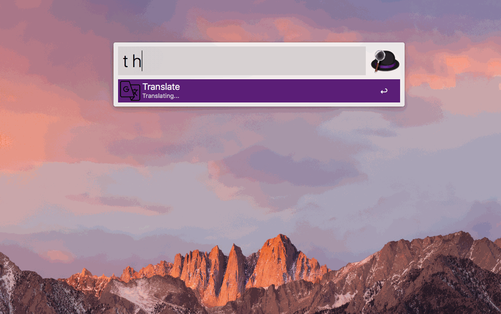

# Alfred's workflow to translate text on the fly

TL;DR:

## Philosophy

I bet you know that feeling when you need to translate a word (or a phrase) and have to switch to a browser, translate, copy, return back and paste the result. Tedious, isn't it?  
Here's where [Alfred](https://www.alfredapp.com) comes in. I love this tool and use it a thousand times a day. Unfortunately, I haven't found any translation-workflow that suits me&#42; so I wrote my own ツ

&#42; I didn't like [the most popular solution](https://github.com/thomashempel/AlfredGoogleTranslateWorkflow) because of its verbosity (driven by a flexibility). Though it's may be what you're looking for.

## Features

  - Translate with only one letter - `t`&#42;
  - Prediction / Autocorrection
  - Multiple translations (in order of importance)
  - No need to specify the direction of translation
  - Select any text and press a hotkey&#42;&#42; to translate it without any extra moves
  - Copy the result into a clipboard by `return` click
  - Redirect to [Google Translate](https://translate.google.com/) by `cmd + return`

&#42; There's also an extra Russian letter `е` which is useful when you need to translate from Russian (no need to switch languages in Alfred)  
&#42;&#42; The default hotkey is `option + t`. But you can always change that in [the workflow's settings](https://www.alfredapp.com/blog/tips-and-tricks/tutorial-importing-and-setting-up-alfred-workflows/)

## Version

Current version is **1.3**

## How to install

  - [Download](https://github.com/NikolayKul/alfred-translate-on-the-fly/raw/master/Translate_on_the_fly.alfredworkflow)
  - Open
  - Click `Import`

## TODO

  - [x] Dynamically define `from` and `to` languages and update an item's icon respectively
  - [x] Suggest autocompletion
  - [x] Generate a meaningful item's `Subtitle`
  - [x] Autocorrect words
  - [x] Add multiple translations
  - [x] Copy the translation on `return` click
  - [x] Add a hotkey
  - [x] Add an extra Russian letter `е` to launch the translation
  - [x] Translate in browser by a hotkey
